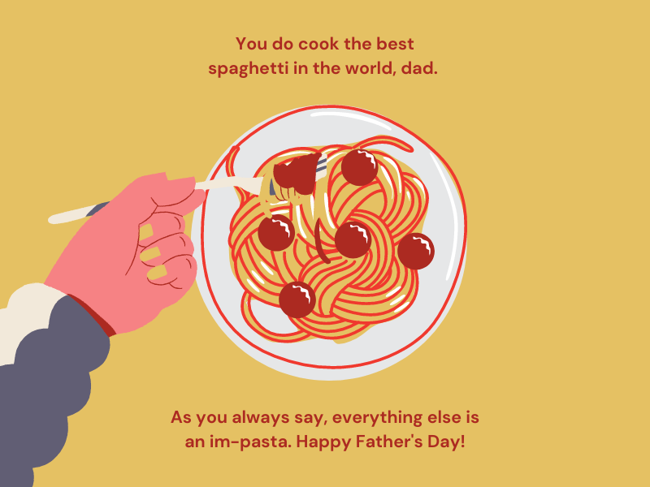

  <div id="top"></div>

<!-- PROJECT LOGO -->
<br />
<div align="center">
  <a href="https://pastashop-hoyeoun.netlify.app/">
    
  </a>

<h3 align="center">Pasta shop</h3>

  <p align="center">
   파스타 스토어의 메뉴 , 메뉴를 카트에 추가 , 수량조절 , 삭제  등을 할수있는 프로젝트입니다.
  </p>
</div>

<!-- ABOUT THE PROJECT -->

## About The Project

<div align="center">
  
</div>
<p>제가 만든 로컬 데이터를 기반으로 제작하였습니다 . </p>

<p align="right">(<a href="#top">back to top</a>)</p>

### Built With

- HTML5
- CSS3
- JavaScript

<p align="right">(<a href="#top">back to top</a>)</p>

<!-- GETTING STARTED -->

## Getting Started

### Prerequisites

프로젝트 실행방법

```
extension live-server download
open with live-server
```

## Description

전반적인 코드의 내용을 해석하고 , 제가 왜 이렇게 작성하였는지 , 어떤 문제들을 겪고 어떻게 해결하였는지 서술 해보도록 하겠습니다 .

제가 사용한 핵심 기술 목록은

<ol>
<li>HTML5</li> 
<li>CSS3</li> 
<li>Vanila JavaScript</li> 
<li>Swiper</li>
</ol>

제가 구현한 기능들에는

<ol>
<li>슬라이드 기능 ( 외부 라이브러리 사용 )</li>
<li>외부 JSON 파일 대신 로컬에서 JSON파일 생성하여 data fetch</li>
<li>아이템을 디스플레이 </li>
<li>카트에 추가 </li>
<li>수량 조절</li>
<li>수량에 따른 가격 계산</li>
<li>아이템 삭제</li>
</ol>

```
//variables
const foodContainer = document.querySelector(".food-container");
const cartIcon = document.querySelector(".cart-icon");
const overLay = document.querySelector(".overlay");
const closeCart = document.querySelector(".close-cart");
const cart = document.querySelector(".cart");
const cartContent = document.querySelector(".cart-content");
const reviewIcon = document.querySelector(".review-icon");
const reviewCart = document.querySelector(".review-cart");
const reviewOverLay = document.querySelector(".review");
const closeCartReview = document.querySelector(".close-cart-review");
const reviewContent = document.querySelector(".review-content");
const cartTotal = document.querySelector(".cart-total");
const cartOrder = document.querySelector(".cart-order");
const clearCart = document.querySelector(".clear-cart");
const swiperWrapper = document.querySelector(".swiper-wrapper");


let buttonArr = [];
let cartArr = [];

```

<p>DOM에 접근해 HTML요소들을 잡아옵니다 .</p>

```
const getPasta = async () => {
  try {
    const res = await fetch("pasta.json");
    const data = await res.json();
    return { data: data.items, review: data.reviews };
  } catch (error) {
    console.log(error);
  }
};
```

<p>로컬 JSON에서 데이터를 fetch해오는 과정입니다 . 저는 로컬 JSON에 reviews와 items라는 element가 2개 있기 때문에 return 할때 . 으로 접근하여 각각 가져왔습니다 .</p>
<p>Promise로 잡아오면</p>

```
const promise1 = new Promise((resolve, reject) => {
  throw 'Uh-oh!';
});

promise1.catch((error) => {
  console.error(error);
});
```

<p>이런식으로 catch문을 사용해 바로 error를 출력시킬수 있지만 , async/await에는 그런 기능이 없어서 try-catch문으로 대체를 할수 있습니다 .</p>

<p> 데이터를 fetch해오는 async await 함수는 </p>

```
document.addEventListener("DOMContentLoaded", () => {
  getPasta()
    .then((pasta) => {
      displayItem(pasta);
      setPastaData(pasta);
      displayReviews(pasta);
      swiperImages(pasta);
    })
    .then(() => {
      getBagBtns();
      clearCartItems();
    });
});
```

<p>이렇게 DOMContentLoaded 이벤트에 붙여 바로 브라우저가 DOM을 생성하면 실행되는 함수로 만들었습니다 . </p>
<p>렌더링은 이런 순서로 진행됩니다 .</p>
<ol>
<li>서버에서 HTML , CSS 파일을 받고 HTML을 DOM트리로 , CSS는 CSSOM트리로 변환합니다</li>
<li>받은 DOM과 CSSOM트리를 Render Tree로 변환합니다 . Render Tree에는 스타일 정보가 있습니다.</li>
<li>Render Tree를 받아와서 그 데이터를 기반으로 레이아웃을 계산하고 , 그립니다 .</li>
<li>레이아웃을 그린뒤에 실제 화면을 그립니다 .</li>
</ol>

<p>저는 이 DOMContendLoaded에 getPasta() 뒤에 계속 체이닝을 해서 function을 실행시키는방식을 선호합니다 .</p>

```
const displayItem = (item) => {
  let result = "";
  item.data.map((pasta) => {
    const { image, name, id, price } = pasta;
    result += `<div class="food-order">
      
      <button class="food-bagBtn" data-id=${id}>
      <i class="fas fa-shopping-cart"></i>
      장바구니에 담기
    </button>
      <div class="food-description">
        <span>$${price}</span>
        <span class="food-name">${name}</span>
      </div>
    </div>`;
  });
  foodContainer.innerHTML = result;
};
```

<p>DOMContentLoaded 에서 실행시킨 getPasta 함수의 return값을 콜백으로 넘겨 displayItem에 인자로 넣고 , 그 인자를 매개변수로 받아 그 매개변수를 map을돌려 display를 진행합니다 .</p>
<p>result 라는 빈 string 변수를 하나 선언하고 , 보간처리를 통해 매개변수의 값에 접근한다음 , result 변수에 할당합니다 .</p>
<p>그후에 부모 컨테이너인 foodContainer라는 DOM요소에 innerHTML 메소드를 실행하여 result 를 할당합니다 .</p>
<p>제 로컬 JSON파일에 있는 아이템의 갯수만큼 map이 돌고 , map안에는 html이 담겨져 있어 이 html을 부모 컨테이너에 삽입을 시킨것 입니다 .</p>

```
const setPastaData = (pasta) => {
  localStorage.setItem("pasta", JSON.stringify(pasta.data));
};
const getPastaData = (id) => {
  const getPasta = JSON.parse(localStorage.getItem("pasta"));
  return getPasta.find((items) => items.id === id);
};
```

<p>localStorage에 담고 , localStorage에 담은 아이템들의 id를 추출하는 작업입니다 . 이 id를 활용해 새로운 객체를 만들어서 그 객체를 cart에서 display를 할것입니다 .</p>

```
const getBagBtns = () => {
  const buttons = [...document.querySelectorAll(".food-bagBtn")];
  buttonArr = buttons;
  buttons.map((btn) => {
    let id = btn.dataset.id;
    btn.addEventListener("click", (e) => {
      e.target.innerText = "장바구니에 담김!";
      e.target.disabled = true;
      let cartItem = { ...getPastaData(id), amount: 1 };
      cartArr = [...cartArr, cartItem];
      addCartItem(cartItem);
      setCartValue(cartArr);
      showCart();
      setItem(cartArr);
    });
  });
};
```

<p>buttons가 여러개의 DOM요소이고 접근을 하면 node-list가 출력이 됩니다 .</p>
<p>node-List 안의 요소에 접근을 하려면 for 문이나 spread operator를 사용해야 했어서 . </p>
<p>const buttons = [...document.querySelectorAll(".food-bagBtn")]; 로 새 배열을 만들었습니다 .</p>
<p>그리고 buttons.map을 돌려서 요소 하나하나에 접근을 해서 eventListener를 붙입니다 .</p>
<p>이벤트 리스너에서 새 객체를 만들고 , 새 배열을 만듭니다 , 새 배열에 새 객체를 할당합니다 . </p>

```
const addCartItem = (item) => {
  const div = document.createElement("div");
  div.classList.add("cart-item");
  const { image, name, price, id, amount } = item;
  div.innerHTML = `
                        <div class='cart-main'>
                          <h4>${name}</h4>
                          <h5>$<span></span>${price}</h5>
                          <span class='remove-item' data-id=${id}><i class="fas fa-trash"></i><span></span>remove</span>
                        </div>
                        <div class='cart-secondary'>
                          <i class="fas fa-chevron-up" data-id=${id}></i>
                          <p class="item-amount">${amount}</p>
                          <i class="fas fa-chevron-down" data-id=${id}></i>
                        </div>`;
  cartContent.appendChild(div);
};
```

<p>아까 addEventListenr에서 만든 새 객체를 인자로 addCartItem에 넘겨주고 버튼을 누를때 실행하게 만듭니다 . addCartItem은 인자 ( 객체 ) 를 받아 createElement('div')안에 innerHTML메서드를 이용해 보간처리한 HTML을 찍어 화면에 렌더링을 합니다 .</p>

```
const setCartValue = (cart) => {
  let tempTotal = 0;
  cart.map((item) => {
    tempTotal += item.price * item.amount;
  });
  cartTotal.innerText = parseFloat(tempTotal.toFixed(2));
};
```

<p>버튼 이벤트에서 실행시킨 또 다른 함수이고 , 이번엔 배열을 인자로 넘겨주어 고차 함수를 돌리도록 설계했습니다 . temTotal이라는 number 타입의 변수를 선언하고 , 이 변수를 나중에 cartTotal이라는 span태그 요소안에 display하도록 했습니다 . 아이템 가격과 아이템 수량을 곱해서 총 토탈 가격을 보여주는 함수입니다 .</p>

```
const removeItem = (id) => {
  cartArr = cartArr.filter((item) => item.id !== id);
  setCartValue(cartArr);
  let button = getSingleButton(id);
  button.disabled = false;
  button.innerHTML = `<i class="fas fa-shopping-cart"></i> 장바구니에 담기`;
};
```

<p>item을 삭제시켜주는 함수입니다 .  id를 받아와서 id와 다른것을 return해주는 방식입니다 </p>

```
const getSingleButton = (id) => {
  return buttonArr.find((btns) => btns.dataset.id === id);
};
```

<p>data-id 에 접근하여 id가 같은 버튼 하나를 return해서 싱글 버튼을 가져오는 함수입니다 .</p>

```
const clearCartItems = () => {
  clearCart.addEventListener("click", () => {
    let cartItems = cartArr.map((item) => item.id);
    cartItems.map((id) => removeItem(id));
    while (cartContent.children.length > 0) {
      cartContent.removeChild(cartContent.children[0]);
    }
  });
  cartContent.addEventListener("click", (e) => {
    if (e.target.classList.contains("remove-item")) {
      const removeItemTarget = e.target;
      const id = removeItemTarget.dataset.id;
      cartContent.removeChild(removeItemTarget.parentElement.parentElement);
      removeItem(id);
    } else if (e.target.classList.contains("fa-chevron-up")) {
      const addAmount = e.target;
      const id = addAmount.dataset.id;
      let tempItem = cartArr.find((item) => item.id === id);
      tempItem.amount = tempItem.amount + 1;
      setCartValue(cartArr);
      addAmount.nextElementSibling.innerText = tempItem.amount;
    } else if (e.target.classList.contains("fa-chevron-down")) {
      const lowerAmount = e.target;
      const id = lowerAmount.dataset.id;
      let tempItem = cartArr.find((item) => item.id === id);
      tempItem.amount = tempItem.amount - 1;
      if (tempItem.amount > 0) {
        setCartValue(cartArr);
        lowerAmount.previousElementSibling.innerText = tempItem.amount;
      } else {
        cartContent.removeChild(lowerAmount.parentElement.parentElement);
        removeItem(id);
      }
    }
  });
};

```

<p>제가만든 함수중에 가장 크고 복잡한 함수인데요 , 하는일은 만약 clearCart라는 DOM요소를 클릭하면 모든 아이템 항목을 한번에 지워주고 , cartContent라는 카트 (div) 안에 클라스 이름에 따라서 3개의 로직이 실행됩니다</p>
<p>첫 이벤트 리스너부터 설명 해보도록 하겠습니다.</p>
<p>우선 cartItems 라는 변수는 cartArr , 제가 state로 만든 배열이고 , 윗 함수를 실행할때 이 배열에 item값을 담아두었었습니다.</p>
<p>그 cartItems 변수에  cartArr안에 들어있는 id만 뺴서 새로 array를 하나만든것입니다 .</p>
<p>그리고 그 id를 가지고 removeItem 함수에 필요한 인자를 한꺼번에 넘겨주어 모든 아이템을 삭제하도록 만들었습니다.</p>
<p>array안에 있는 아이템은 없어졌지만 cartContent에 들어있는 요소를 removeChild를 시켜주어야 디스플레이 된 항목들도 사라지더라구요 , 그래서 while문을 사용해 cartContent의 children의 길이가 0보다 크면 (아이템이 존재하면) removeChild를 통해 첫번쨰 노드를 삭제시켜 모든 아이템의 디스플레이를 없애는것이었습니다.</p>

```
 clearCart.addEventListener("click", () => {
    let cartItems = cartArr.map((item) => item.id);
    cartItems.map((id) => removeItem(id));
    while (cartContent.children.length > 0) {
      cartContent.removeChild(cartContent.children);
    }
```

<p>처음에는 코드를 이렇게 작성하였는데 , 계속  </p>

```
Uncaught TypeError: Failed to execute 'removeChild' on 'Node': parameter 1 is not of type 'Node'.
    at HTMLButtonElement.<anonymous>
```

<p>이런 오류가 떠서 console.log(cartContent.children)을 확인해보았습니다 .</p>

```
HTMLCollection []
0: div.cart-item
1: div.cart-item
length: 2
[[Prototype]]: HTMLCollection
```

<p>이렇게 나오는데 , 저는 이해가 잘 가지않았습니다 , 전체를 지우려면 , 그냥 </p>

```
while (cartContent.children.length > 0) {
      cartContent.removeChild(cartContent.children);
    }
```

<p>이렇게 지우면 되는것이 아닌가 하고 검색을 해보니 , 여기 어떤분이 </p>
<p>
The length of your HTMLCollection changes when you remove an item. A way to do it is to use a while loop</p>

```
while(paragraphs.length > 0) {
   paragraphs[0].remove();
}
```

<p>This will only work as long as you guarantee to remove all child nodes </p>
<p>// 모든 childnode를 지운다는 것이라면 , 이방법이 유일할 것입니다</p>

<p>이라고 작성을 해주셔서 , 인덱스에 접근을 해야한다는것을 깨닫고 [0]을 붙여보니 깨끗하게 삭제가 되는것을 알게 되었습니다 .</p>

출처: https://stackoverflow.com/questions/23988982/removing-htmlcollection-elements-from-the-dom/23989309

```
cartContent.addEventListener("click", (e) => {
    if (e.target.classList.contains("remove-item")) {
      const removeItemTarget = e.target;
      const id = removeItemTarget.dataset.id;
      cartContent.removeChild(removeItemTarget.parentElement.parentElement);
      removeItem(id);
    } else if (e.target.classList.contains("fa-chevron-up")) {
      const addAmount = e.target;
      const id = addAmount.dataset.id;
      let tempItem = cartArr.find((item) => item.id === id);
      tempItem.amount = tempItem.amount + 1;
      setCartValue(cartArr);
      addAmount.nextElementSibling.innerText = tempItem.amount;
    } else if (e.target.classList.contains("fa-chevron-down")) {
      const lowerAmount = e.target;
      const id = lowerAmount.dataset.id;
      let tempItem = cartArr.find((item) => item.id === id);
      tempItem.amount = tempItem.amount - 1;
      if (tempItem.amount > 0) {
        setCartValue(cartArr);
        lowerAmount.previousElementSibling.innerText = tempItem.amount;
      } else {
        cartContent.removeChild(lowerAmount.parentElement.parentElement);
        removeItem(id);
      }
    }
  });
```

<p>이 파트에 대해서 설명을 하자면 , 카트에 여러가지 아이콘이 있는데 그 아이콘을 누르면 어떠한 동작을 하게끔 짠 코드입니다 .</p>

<p>첫째로 , 휴지통 아이콘을 누를때 실행되는 로직입니다</p>
<p>e.target.dataset.id 로 아이디를 잡아오고 , cartContent DOM 요소에 들어있는 아이템을 삭제하는데 , 아이콘의 부모의 부모 (div)를 삭제해야 디스플레이가 삭제됨으로 그렇게 짰습니다 . removeItem에 인자를 넘겨주어 배열에서도 항목을 삭제합니다 .</p>
<p>두번쨰로 , 위화살표 버튼을 누르면 수량을 증가시키려는데 , 아까 카트에 추가하는 기능을 하는 버튼을 만들때에 , 새로 만든 객체가있는데 그 객체에 amount를 제가 추가를 했었습니다 . 그리고 이 amount를 카트에 디스플레이도 했었는데요 , 클릭을 할때에 cartArr(state)에서 같은 id를 가지고있는 항목을 찾아 , tempItem에 할당을 한뒤(객체타입) .을 통해 amount에 접근을 하여 + 1 을 해주어 수량을 높이고 , setCartValue에 state를 넘겨 가격과 수량에 맞는 총 가격을 다시계산합니다 . </p>
<p>그리고 amount숫자를 디스플레이 하기위해 addAmount (e.target) 의 다음 요소 (nextElementSibling)에 innerText를 하여 숫자를 디스플레이 합니다 .</p>
<p>셋째로 , 아래 화살표 버튼을 누르면 수량을 감소시키는데 , 수량이 0보다 클때는 바로 lowerAmount의 이전요소 innerText에 디스플레이를 하고 ,</p>
<p>수량이 0보다 가깝거나 0일때는 삭제를 시켜주는 코드입니다 .</p>

```
import Swiper from "https://unpkg.com/swiper@7/swiper-bundle.esm.browser.min.js";

const swiper = new Swiper(".swiper", {
  autoplay: {
    delay: 3000,
  },
  effect: "fade",
  fadeEffect: {
    crossFade: true,
  },
  pagination: {
    el: ".swiper-pagination",
    type: "bullets",
  },
  controller: {
    inverse: false,
  },
});

```

<p>외부 라이브러리 Swiper를 이용해 슬라이드 쇼를 구현하였고 , 공식문서를 참조했습니다. </p>

## Contact

gmail - qusghdus12345@gmail.com

블로그 [https://jay0811.tistory.com/](https://jay0811.tistory.com/)

<p align="right">(<a href="#top">back to top</a>)</p>

## url

프로젝트 url: [https://pastashop-hoyeoun.netlify.app/](https://pastashop-hoyeoun.netlify.app/)

## 긴글 읽어주셔서 감사합니다

<p align="right">(<a href="#top">back to top</a>)</p>
